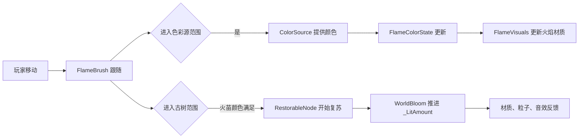

# FirePlay：首个纵向切片技术设计

## 1. 目标与完成画面

本切片只做一条完整的体验链：

> 玩家进入一片褪色林地 → 手边的火苗接触一朵粉色花 → 火苗变为粉色 → 靠近灰色古树 → 古树沿着有机边缘恢复淡彩、开出花瓣，并响起一声柔和反馈。

完成这一段，即同时验证：第三人称操作、火苗作为表达工具、颜色采集、世界复苏，以及水墨到淡彩的核心视觉语言。

## 2. 这一阶段的边界

### 包含

- 一位本地玩家与第三人称相机；
- 跟随玩家的火苗；
- 一个色彩源（花）；
- 一个可复苏目标（古树）；
- 一份火苗配置与一份节点配置；
- 一个以 `_LitAmount` 为核心参数的 URP Shader Graph；
- 基础粒子、音效与屏幕提示。

### 暂不包含

- 存档、篝火、路标、联网；
- 自由绘制地表；
- 多种颜色与解谜条件；
- 自定义 Render Feature 和全屏后处理。

## 3. 文件结构

```text
Assets/FirePlay/
  Scenes/
    Prototype_Forest.unity
  Prefabs/
    Player.prefab
    FlameBrush.prefab
    ColorFlower.prefab
    RestorableTree.prefab
  Scripts/
    Core/
      FirePlayBootstrapper.cs
    Player/
      PlayerMovement.cs
      PlayerInteraction.cs
    Flame/
      FlameBrush.cs
      FlameColorState.cs
    World/
      ColorSource.cs
      RestorableNode.cs
    Rendering/
      FlameVisuals.cs
      WorldBloom.cs
    Data/
      FlameBrushConfig.cs
      RestorableNodeConfig.cs
  Art/
    Materials/
      M_InkRestorable.mat
    Shaders/
      SG_InkRestorable.shadergraph
      SG_Flame.shadergraph
    VFX/
      P_AbsorbColor.prefab
      P_WorldBloom.prefab
```

## 4. 场景摆放

在 `Prototype_Forest` 中先用 ProBuilder 或简单模型搭出 20 × 30 米的平缓林地：

- 出生点位于小径起点；
- 左前方 6 米放一朵 `ColorFlower`；
- 古树位于花之后约 8 米处；
- 古树周围安排灰色石头与草地，作为对比；
- 使用一盏暖色 Directional Light 与低强度雾；
- 场景内不要同时放太多物件，留出视觉呼吸感。

建议把色彩源和古树都放入 `Interactable` Layer；火苗用触发范围检测，而非玩家身体直接碰撞。

## 5. 运行时数据流



这条链路的原则是：**玩法脚本决定状态，视觉脚本读取状态并表现出来。** 不要让 Shader 或粒子系统承担游戏规则。

## 6. 脚本职责

### `FlameBrushConfig`（ScriptableObject）

存放可调参数，避免把美术数值硬编码在脚本中：

- 初始颜色；
- 跟随高度与平滑速度；
- 触发半径；
- 火焰材质发光强度；
- 粒子预制体。

### `FlameColorState`

只保存运行时火苗状态：

- `Color CurrentColor`；
- `float Intensity`；
- `bool HasColor`；
- `SetColor(Color color)`。

它不关心玩家、花或古树；这样以后网络同步和存档时也更容易替换。

### `FlameBrush`

挂在火苗预制体上，负责：

- 平滑跟随玩家的锚点；
- 通过球形触发器查找 `ColorSource` 与 `RestorableNode`；
- 将颜色源交给 `FlameColorState`；
- 将当前颜色传给目标节点。

第一版可直接用 `OnTriggerEnter`；之后若要“靠近持续点亮”，再改为 `OnTriggerStay` 或主动查询。

### `ColorSource`

挂在花、水或落叶等对象上，负责：

- 提供一种颜色；
- 被吸收后的冷却或一次性状态；
- 播放自身的吸收反馈。

第一版花被吸收后不消失，只降低饱和度，过几秒恢复。这样玩家能看懂发生了什么。

### `RestorableNode`

挂在古树根节点上，负责：

- 定义接受的颜色或颜色类别；
- 判断火苗是否可触发；
- 管理未复苏、复苏中、已复苏三种状态；
- 将进度交给 `WorldBloom`；
- 在完成时播放粒子与音效。

不要在该脚本中直接处理材质细节；它只调用 `WorldBloom.SetLitAmount(float)`。

### `WorldBloom`

挂在可复苏模型上，负责：

- 为每个 Renderer 创建 `MaterialPropertyBlock`；
- 把 `_LitAmount` 与 `_BloomColor` 写入材质；
- 提供从 0 平滑推进到 1 的协程或 Tick 方法；
- 触发花瓣、光点等纯视觉对象。

使用 `MaterialPropertyBlock`，不要直接修改共享材质；否则所有使用同材质的树会一起改变。

### `FlameVisuals`

负责火苗的 Renderer、Light 与粒子：

- 读取 `FlameColorState.CurrentColor`；
- 写入火焰材质的 `_FlameColor`；
- 同步 Point Light 的颜色；
- 轻微调整粒子的 Main Color 与发光强度。

## 7. 配置资产

第一版创建两个 ScriptableObject：

### `FlameBrushConfig_Prototype`

- Initial Color：`#FFD27A`
- Follow Height：`1.35`
- Follow Smooth Time：`0.18`
- Interaction Radius：`1.25`
- Light Range：`3.0`
- Light Intensity：`1.4`

### `RestorableNodeConfig_Tree`

- Restore Duration：`1.8`
- Required Color：花粉红；
- Bloom Color：`#F5A6C8`
- Completion VFX：花瓣与小光点；
- Completion SFX：柔和木质铃音。

## 8. Shader Graph：第一版水墨复苏材质

创建 `URP Lit Shader Graph`，暴露以下属性：

| 属性 | 类型 | 用途 |
|---|---|---|
| `_LitAmount` | Float (0–1) | 复苏总进度 |
| `_BaseColor` | Color | 完整淡彩颜色 |
| `_InkColor` | Color | 未复苏的墨灰颜色 |
| `_BloomColor` | Color | 复苏边缘的微光颜色 |
| `_NoiseTex` | Texture2D | 有机笔触边缘 |
| `_NoiseScale` | Float | 噪声大小 |
| `_EdgeWidth` | Float | 发光边缘宽度 |

### 节点逻辑

1. 用 `Sample Texture 2D` 采样噪声纹理的 R 通道；
2. 将 `_LitAmount` 减去噪声值的一小部分，得到受扰动的阈值；
3. 用 `Smoothstep` 生成柔和遮罩 `restoreMask`；
4. 用 `Lerp(_InkColor, _BaseColor, restoreMask)` 生成基础色；
5. 再用一次较窄的 `Smoothstep` 计算过渡边缘；
6. 将边缘乘 `_BloomColor`，接入 Emission；
7. 接入 URP Lit Master 的 Base Color 与 Emission。

核心公式可以先记成：

```text
restoreMask = Smoothstep(progress - width, progress + width, noise)
baseColor   = Lerp(inkColor, baseColor, restoreMask)
edge        = restoreMask - Smoothstep(progress, progress + edgeWidth, noise)
emission    = edge × bloomColor
```

这里最值得学习的 TA 概念是：**遮罩（mask）决定哪里发生变化，Lerp 决定两个视觉状态怎样混合，噪声让规则的边界变得自然。**

## 9. 火苗 Shader Graph：第一版目标

火苗先做成一个始终朝向相机的 Quad：

- Unlit、Transparent；
- 使用一张软边火焰贴图，或从渐变生成形状；
- `Fresnel Effect` 提供边缘亮感；
- `Time` + `Simple Noise` 轻微扭动 UV；
- 用 `_FlameColor` 控制颜色；
- 用 Emission 让其带有温暖感。

火苗应该小而安静，避免像魔法攻击特效。玩家注意到的是“陪伴感”，不是强烈的战斗反馈。

## 10. 实施检查清单

1. 新建 URP 场景、地面、玩家胶囊体与第三人称相机；
2. 制作火苗预制体：Quad、Point Light、Sphere Trigger、`FlameBrush`；
3. 实现 `FlameColorState` 和花的 `ColorSource`；
4. 实现古树的 `RestorableNode` 与 `WorldBloom`；
5. 做 `_LitAmount` 驱动的第一版 Shader Graph；
6. 添加吸色与复苏粒子、音效；
7. 从出生点开始完整走一遍，并调整距离、时长、亮度；
8. 邀请一位未参与开发的人试玩，不解释规则，观察他是否自然走向花和古树。

## 11. 验收标准

- 玩家能在 30 秒内意识到火苗会跟随自己；
- 接触花后，玩家能清楚看出火苗获得了颜色；
- 靠近古树时，颜色复苏过程清晰、有机且不突兀；
- 完成复苏后，玩家会停下来观察至少一瞬，而不是只把它当开门按钮；
- 即使没有文字说明，玩家能理解“火苗使世界恢复了颜色”。

## 12. 本切片完成后的自然下一步

把一个花与一棵树扩展为三个色彩源、八个复苏节点；再加入篝火和本地保存的火种路标。到那时才值得讨论场景叠加、事件总线接入与异步多人数据。
